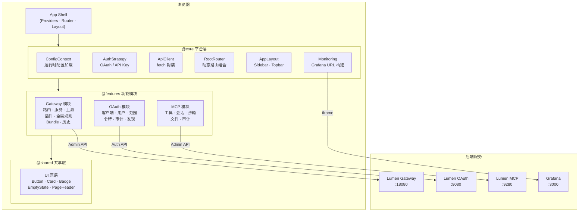
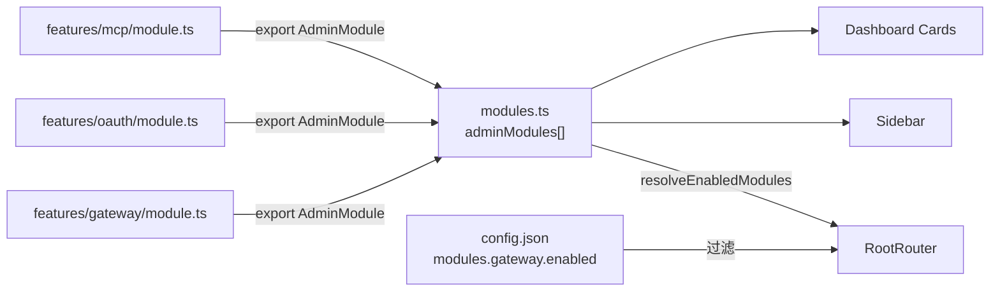
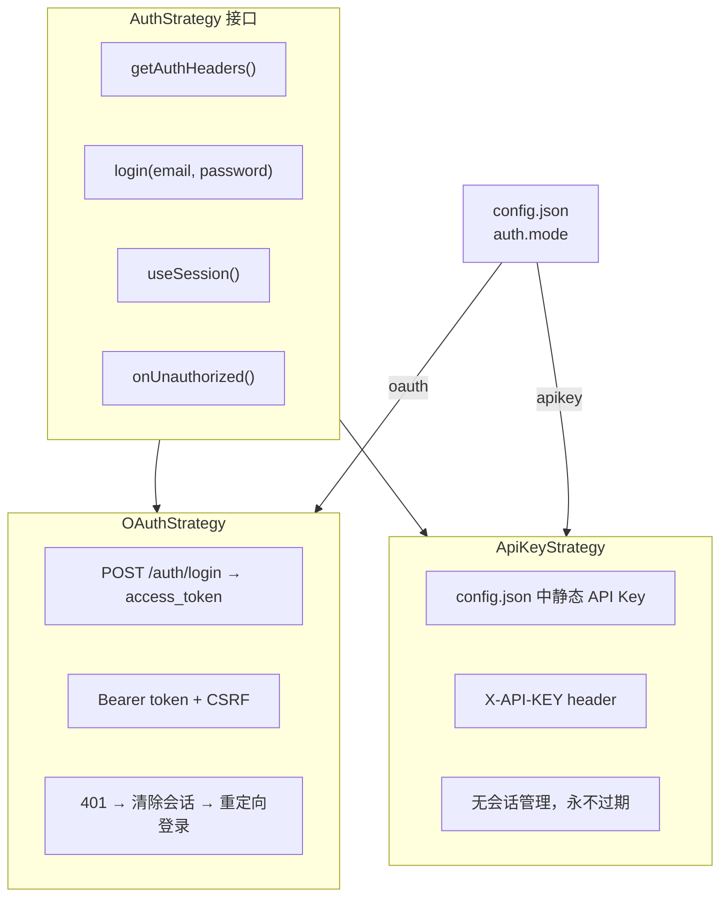
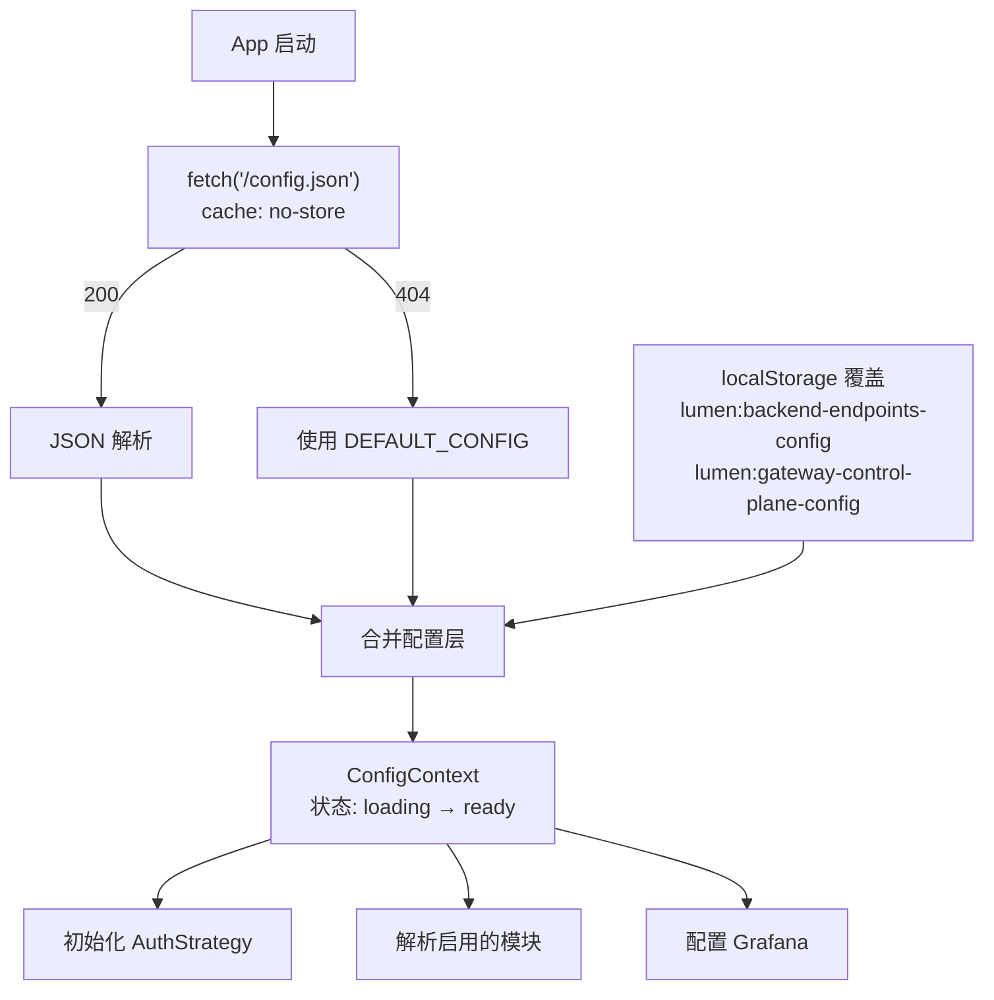
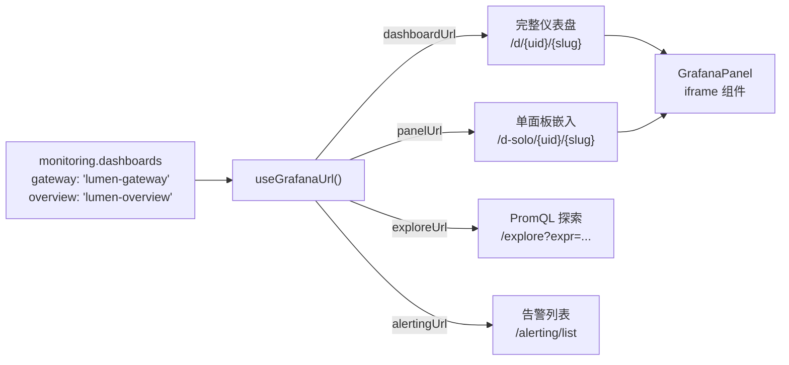
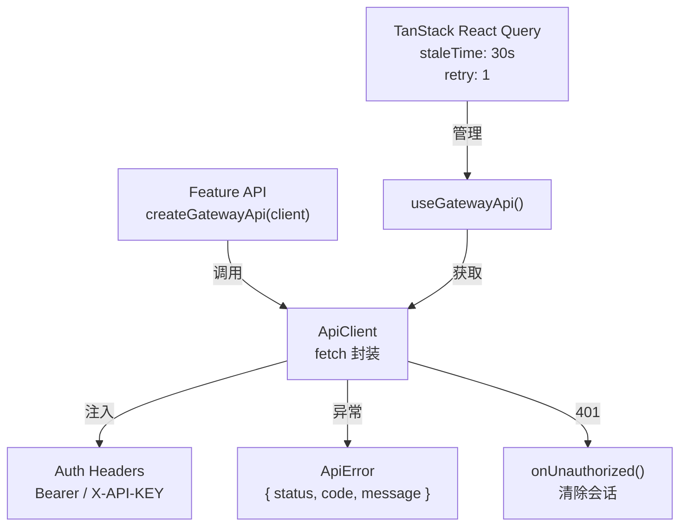
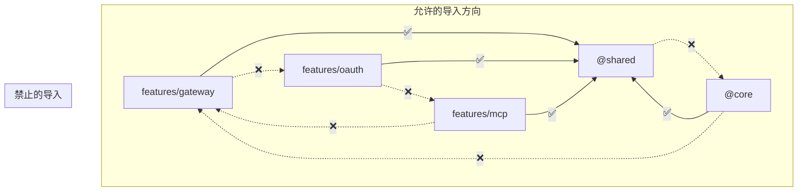

# Lumen Admin UI 技术方案

## 1. 项目背景与目标

### 1.1 项目定位

Lumen Admin UI 是 Lumen 平台的统一 Web 管理控制台，基于 React 18 + TypeScript + Vite 构建。通过模块化设计，单一构建产物可按需启用 Gateway、OAuth、MCP 三大功能模块，运行时通过 `/config.json` 切换后端地址和功能开关，无需重新编译。

### 1.2 核心目标

| 目标 | 描述 |
|------|------|
| **模块隔离** | 三大功能模块（Gateway / OAuth / MCP）代码完全隔离，ESLint 强制禁止跨模块导入 |
| **运行时配置** | `/config.json` 热加载，后端地址、认证模式、功能开关全部运行时决定，零重编译 |
| **双认证策略** | 支持 OAuth 2.0 登录和 API Key 静态认证，策略模式一键切换 |
| **可观测性集成** | Grafana iframe 嵌入，PromQL 查询构建，监控面板与管理界面统一入口 |
| **开箱即用** | Docker 多阶段构建，Nginx SPA 服务，配合 Docker Compose 一键启动 |

### 1.3 对标项目

| 项目 | 技术栈 | 对比 |
|------|--------|------|
| [APISIX Dashboard](https://github.com/apache/apisix-dashboard) | Vue 3 + Ant Design | Lumen UI 模块化更彻底，支持多后端运行时切换 |
| [Kong Manager (OSS)](https://github.com/Kong/kong-manager) | Vue 3 | Lumen UI 集成 OAuth + MCP 管理，不限于网关 |
| [Grafana](https://github.com/grafana/grafana) | React + Go | Lumen UI 直接嵌入 Grafana 面板，无需独立监控入口 |

**核心差异化**：唯一同时管理 API 网关控制面、OAuth 授权服务和 MCP AI 工具的统一控制台，运行时配置驱动，适配从开发到生产的所有环境。

---

## 2. 整体架构

### 2.1 系统架构



### 2.2 设计原则

| 原则 | 实现方式 |
|------|----------|
| **模块隔离** | ESLint `no-restricted-imports` 强制 features 不互相导入 |
| **依赖反转** | core 不导入 features，shared 不导入 core/features |
| **策略模式** | AuthStrategy 接口隔离 OAuth / API Key 认证细节 |
| **运行时驱动** | `/config.json` fetch + localStorage overlay，不打包配置 |
| **关注点分离** | API 工厂函数纯逻辑可测试，hooks 封装 React 绑定 |

---

## 3. 技术选型

### 3.1 核心框架

| 层面 | 选型 | 理由 |
|------|------|------|
| **UI 框架** | React 18 | 生态成熟，hooks 模式适合复杂状态管理 |
| **类型系统** | TypeScript (strict) | 编译期类型安全，接口定义即文档 |
| **构建工具** | Vite + esbuild | 亚秒级 HMR，Tree-shaking，ES2022 target |
| **样式方案** | Tailwind CSS + CSS 变量 | 原子化 CSS 零冲突，语义化 Design Token 支持暗色模式 |
| **路由** | React Router v6 | 嵌套路由 + 动态组合，模块自注册 |
| **服务端状态** | TanStack React Query | 30s staleTime，自动缓存失效，乐观更新 |
| **客户端状态** | Zustand | 轻量状态管理，无 Provider 嵌套 |
| **表单** | React Hook Form + Zod | 声明式校验，Schema 即文档 |
| **动画** | Framer Motion | 声明式过渡动画 |
| **图标** | Lucide React | Tree-shakable SVG 图标库 |

### 3.2 未选方案

| 方案 | 未选理由 |
|------|----------|
| Next.js / Remix | 纯 SPA 即可，无需 SSR/SSG 复杂性 |
| Ant Design / MUI | 包体过大，样式定制成本高，Tailwind 更灵活 |
| Redux Toolkit | 过重，Zustand + React Query 已覆盖全部需求 |
| CSS Modules | 无原子化复用，跨组件一致性差 |

---

## 4. 核心模块设计

### 4.1 模块系统

#### AdminModule 接口

```typescript
interface AdminModule {
  id: KnownModuleId;           // "gateway" | "oauth" | "mcp"
  displayName: string;
  icon: LucideIcon;
  basePath: string;            // "/gateway" | "/oauth" | "/mcp"
  description: string;
  routes: RouteObject[];       // React Router 子路由
  menu: ModuleMenuEntry[];     // 侧边栏菜单项
  probe?: (config) => Promise<boolean>;  // 健康探测
}
```

#### 模块注册流程



#### 新增模块步骤

1. 创建 `src/features/<id>/module.ts`，导出 `AdminModule` 实例
2. 在 `src/core/config/types.ts` 的 `KnownModuleId` 联合类型中添加 ID
3. 在 `src/core/router/modules.ts` 的 `adminModules` 数组中追加
4. 侧边栏、仪表盘、路由自动发现，无需其他改动

### 4.2 认证策略



**OAuth 模式流程**：
1. 页面加载 → 检查内存会话 → 无会话 → 展示登录页
2. 用户输入邮箱密码 → `POST {issuer}/auth/login`
3. 返回 `access_token` + `csrf_token` + `user` 对象
4. `access_token` 存内存（`useSyncExternalStore`），`csrf_token` 存 `localStorage`
5. 后续请求注入 `Authorization: Bearer <token>` 头
6. 收到 401 → `onUnauthorized()` 清除会话 → 重定向登录页

**API Key 模式流程**：
1. 配置文件中指定 `auth.apiKey`
2. 合成 admin 用户，`scopes: ["admin:*"]`
3. 所有请求注入 `X-API-KEY` 头
4. 无登录页、无会话管理

### 4.3 运行时配置系统



**配置结构**：

```typescript
interface RuntimeConfig {
  auth: {
    mode: "oauth" | "apikey";
    issuer?: string;         // OAuth 模式: 授权服务地址
    clientId?: string;
    scopes?: string[];
    apiKey?: string;         // API Key 模式: 静态密钥
  };
  modules: {
    gateway:    { enabled: boolean; baseUrl: string; apiKey?: string };
    oauth:      { enabled: boolean; baseUrl: string };
    mcp:        { enabled: boolean; baseUrl: string };
    monitoring: { enabled: boolean; baseUrl: string; dashboards: Record<string, string> };
  };
  ui: { theme: "light" | "dark" | "system"; defaultLanding: string };
  features: FeatureFlags;    // oauthApiEnabled, mcpApiEnabled, dcrEnabled...
}
```

### 4.4 Gateway 模块

**功能矩阵**：

| 页面 | 功能 | 对应 Admin API |
|------|------|----------------|
| Overview | 统计、最近历史、健康状态 | `GET /stats` |
| Routes | 路由 CRUD，URI 编码（exact/prefix/regex） | `/apisix/admin/routes` |
| Services | 服务 CRUD | `/apisix/admin/services` |
| Upstreams | 上游 CRUD，健康检查配置 | `/apisix/admin/upstreams` |
| Plugin Configs | 插件配置 CRUD | `/apisix/admin/plugin_configs` |
| Global Rules | 全局规则 CRUD | `/apisix/admin/global_rules` |
| Import | 文件上传 → 预览变更 → 应用 | `POST /preview-import`, `POST /apply-import` |
| History | 配置变更历史 + 回滚 | `GET /history`, `POST /rollback` |
| Export | YAML/JSON 格式批量导出 | `GET /export` |

**URI 编码规则**：
- Exact: `= /api/v1/users` → 精确匹配
- Prefix: `/api/v1/*` → 前缀匹配
- Regex: `~ ^/api/v[0-9]+/` → 正则匹配

**插件表单引擎**：
- 9 个内置插件提供类型化表单（request_id, limit_count, replace_path 等）
- 未识别插件 → 降级为 `CustomPluginState[]` 的 JSON 编辑器
- 自定义表单组件：Field, Input, NumberInput, Select, Toggle, PluginSection, KVEditor, TagListEditor

### 4.5 OAuth 模块

| 页面 | 功能 |
|------|------|
| Overview | 统计摘要、最近审计 |
| Clients | OAuth 客户端 CRUD（clientId, grants, redirects, status） |
| Users | 用户列表、角色查看 |
| Scopes | 范围和角色管理 |
| Tokens | 活跃令牌列表（只读） |
| Audit | 审计日志分页 |
| Discovery | OIDC 发现端点和 JWKS 展示 |

### 4.6 MCP 模块

| 页面 | 功能 |
|------|------|
| Overview | 工具数、会话数、调用频率、错误率 |
| Tools | 工具目录浏览、过滤 |
| Sessions | 活跃 AI Agent 会话列表 |
| Playground | 工具调用沙箱（直接在浏览器中测试 MCP 工具） |
| File Bundle | 文件驱动的批量控制面操作 |
| Audit | 工具调用审计日志（tool, principal, result, traceId） |

### 4.7 监控集成



参数注入：`orgId`, `from/to`, `refresh`, `theme`, `kiosk`, `var-*` 模板变量。默认 Kiosk 模式隐藏 Grafana 顶栏。

---

## 5. API 客户端架构

### 5.1 分层设计



**ApiClient 职责边界**：
- 负责：baseUrl 拼接、认证头注入、JSON 解析、错误转 ApiError、15s 超时
- 不负责：重试、缓存、去重（交给 TanStack Query）

**模块 API 工厂**：
```
useModuleApiClient("gateway")
  → 查找 config.modules.gateway.baseUrl
  → 检查模块级 apiKey 覆盖
  → 返回绑定好的 ApiClient 实例
```

---

## 6. UI 设计系统

### 6.1 Design Token

```css
/* 语义化颜色变量 */
--bg           /* 主背景 */
--bg-elevated  /* 卡片/弹窗背景 */
--bg-subtle    /* hover/选中背景 */
--fg           /* 主文字 */
--fg-muted     /* 次要文字 */
--fg-subtle    /* 辅助文字 */
--accent       /* 主题色 */
--success / --warning / --danger  /* 状态色 */
```

暗色模式通过 `<html class="dark">` 切换，CSS 变量自动翻转。Tailwind 配置扩展这些语义 Token。

### 6.2 共享组件

| 组件 | 用途 |
|------|------|
| `Button` | primary / secondary / ghost / danger 变体，sm / md 尺寸 |
| `Card` / `CardHeader` / `CardBody` | 布局容器 |
| `Badge` | 状态指示器 |
| `EmptyState` | 空数据提示 |
| `PageHeader` | 页面标题 + 描述 + 操作区 |
| `GrafanaPanel` | Grafana iframe 嵌入组件 |
| `cn()` | clsx + tailwind-merge 的 className 合并工具 |

---

## 7. 模块隔离规则

### 7.1 ESLint 强制约束



**规则细节**：
- 全局规则：禁止导入 `@features/gateway/*`、`@features/oauth/*`、`@features/mcp/*`
- 模块内例外：每个 feature 可以导入自身（如 gateway 内文件可导入 `@features/gateway/*`）
- core 约束：`src/core/**` 不可导入任何 `@features/*`
- shared 约束：`src/shared/**` 不可导入 `@core/*` 或 `@features/*`
- 唯一例外：`src/core/router/modules.ts` 使用 ESLint 注释豁免，负责组合所有模块

---

## 8. 构建与部署

### 8.1 Vite 构建配置

| 配置项 | 值 | 说明 |
|--------|------|------|
| Target | ES2022 | 现代浏览器 |
| 代码分割 | `react`（vendor）、`query`（TanStack） | 按依赖分 chunk |
| Source Map | enabled | 生产环境调试 |
| 路径别名 | `@` → `src/`, `@core`, `@shared`, `@features` | 简化导入路径 |
| Dev Port | 5173 (strict) | 固定端口，不自动递增 |

### 8.2 Docker 多阶段构建

```dockerfile
# Stage 1: 编译
FROM node:20-alpine
RUN corepack enable && corepack prepare pnpm@9.12.2
COPY . .
RUN pnpm install --frozen-lockfile && pnpm build

# Stage 2: 运行
FROM nginx:1.27-alpine
COPY --from=builder /app/dist /usr/share/nginx/html
COPY deploy/nginx.conf /etc/nginx/conf.d/default.conf
```

### 8.3 Nginx 配置策略

| 资源 | 缓存策略 | 理由 |
|------|----------|------|
| `index.html` | `no-cache` | 入口文件始终最新 |
| `/config.json` | `no-cache` | 运行时配置始终最新 |
| `*.js` / `*.css` / fonts | `1 year, immutable` | 内容哈希文件名，永久缓存 |
| `/health` | 无日志 | 健康探测端点，避免日志污染 |

安全头：`X-Frame-Options: SAMEORIGIN`、`X-Content-Type-Options: nosniff`、`Referrer-Policy: strict-origin-when-cross-origin`

SPA 路由：`try_files $uri $uri/ /index.html`

### 8.4 全栈部署（Docker Compose 一键启动）

Lumen Admin UI 是 Lumen 全栈平台的一部分。使用根目录的 `docker-compose.yml` 可一键启动所有 8 个服务：

```bash
cd api-gateway
docker compose up -d --build
```

**启动顺序**：`etcd` + `PostgreSQL` → `Gateway` → `OAuth` → `MCP Server` + `Prometheus` → `Grafana` → `Admin UI`

Admin UI 等待所有后端服务健康后才启动。启动后访问：

```bash
# 健康检查
curl http://localhost:5173/health

# 浏览器打开管理控制台
open http://localhost:5173
# 默认管理员: admin@example.com / admin
```

Docker Compose 通过 volume 挂载 `configs/fullstack/admin-ui.config.json` 到容器内的 `/usr/share/nginx/html/config.json`，启用全部模块（Gateway + OAuth + MCP + Monitoring）。

**全栈端口一览**：

| 服务 | 端口 | 地址 |
|------|------|------|
| Gateway | 18080 | http://localhost:18080 |
| OAuth | 9080 | http://localhost:9080 |
| MCP Server | 9280 | http://localhost:9280 |
| Admin UI | 5173 | http://localhost:5173 |
| Grafana | 3000 | http://localhost:3000 |
| Prometheus | 9090 | http://localhost:9090 |
| etcd | 2379 | http://localhost:2379 |
| PostgreSQL | 5432 | localhost:5432 |

---

## 9. 代码结构

```
src/
├── core/                    平台层（模块感知，功能无关）
│   ├── app/                 App Shell, Providers, Dashboard, NotFound
│   ├── config/              ConfigContext, ModuleRegistry, 类型定义
│   ├── api/                 ApiClient + ApiError + 模块客户端工厂
│   ├── auth/                AuthStrategy 接口, OAuth / API Key 策略
│   │                        LoginPage, RegisterPage, VerifyEmailPage
│   ├── layout/              Sidebar, Topbar, AppLayout, ModuleTabs
│   ├── router/              RootRouter, 模块路由组合
│   └── monitoring/          Grafana URL 构建 + iframe 集成
│
├── features/
│   ├── gateway/             Gateway 控制面 UI
│   │   ├── api/             API 客户端（路由/服务/上游/插件 CRUD）
│   │   ├── pages/           ResourceListPage, BundleImport, History, Export
│   │   └── components/      ResourceFormDrawer, JSON 编辑器, 插件表单
│   ├── oauth/               OAuth 管理 UI
│   │   ├── api/             OAuth API 客户端
│   │   └── pages/           Clients, Users, Scopes, Tokens, Audit, Discovery
│   └── mcp/                 MCP 管理 UI
│       ├── api/             MCP API 客户端
│       └── pages/           Tools, Sessions, Playground, FileBundle, Audit
│
└── shared/                  框架无关 UI 原语
    ├── ui/                  Button, Card, Badge, EmptyState, PageHeader, GrafanaPanel
    └── utils/               cn() 工具函数
```

---

## 10. 测试策略

| 层面 | 工具 | 覆盖范围 |
|------|------|----------|
| **单元测试** | Vitest + jsdom | 工具函数、API 客户端、配置解析 |
| **E2E 测试** | Playwright | 登录流程、模块导航、资源 CRUD |
| **集成测试** | Playwright Integration Config | 跨模块交互、OAuth 授权流 |

---

## 11. 未来规划

| 方向 | 计划 |
|------|------|
| **代码分割** | 按模块懒加载，减少首屏 bundle |
| **暗色模式** | 完善 Design Token，支持 system/light/dark 三模式 |
| **国际化 (i18n)** | react-intl 或 i18next，中英双语 |
| **WebSocket 实时更新** | 路由变更、健康状态实时推送 |
| **RBAC 权限控制** | 按用户角色显隐模块和操作按钮 |
| **MCP Playground 增强** | 工具链式调用、参数模板、历史回放 |
