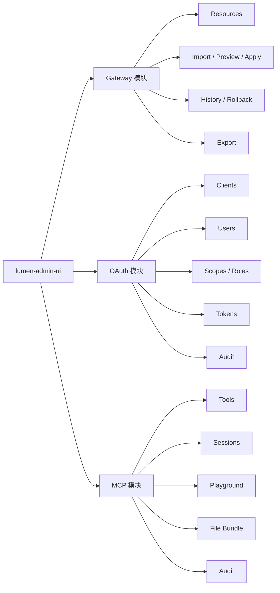
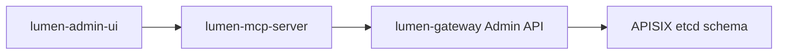

# Lumen Admin UI 原型与集成方案

> 目标：把 `lumen-gateway`、`lumen-OAuth`、`lumen-mcp-server` 放进一个统一控制台里，同时保持模块边界清晰、部署简单、权限可控。

---

## 1. 当前判断

### 1.1 网关侧是否已经够 UI 对接

**结论：够了，可以开始接第一版 UI。**

`lumen-gateway` 目前已经具备：

- APISIX 风格资源 CRUD
- `preview / apply / export / history / rollback`
- `validate`
- `schema / capability`
- 列表 `page / page_size / keyword`
- 列表项 `summary`

这意味着 Gateway 模块的三类核心页面已经有稳定后端：

- 资源列表页
- Bundle Import / Preview / Apply 页
- History / Rollback 页

### 1.2 OAuth / MCP 侧现状

这两个模块目前更适合先按 **原型页 + mock adapter + API contract** 推进：

- `lumen-OAuth`：先按客户端、用户、scope、token、audit 五类页面设计
- `lumen-mcp-server`：先按 tools、sessions、playground、file-bundle、audit 五类页面设计

---

## 2. 统一控制台信息架构



---

## 3. 左侧导航建议

```text
Lumen Console
├── Gateway
│   ├── Overview
│   ├── Routes
│   ├── Services
│   ├── Upstreams
│   ├── Plugin Configs
│   ├── Global Rules
│   ├── Bundle Import
│   ├── History
│   └── Export
│
├── OAuth
│   ├── Overview
│   ├── Clients
│   ├── Users
│   ├── Scopes
│   ├── Tokens
│   ├── Audit
│   └── Discovery
│
└── MCP
    ├── Overview
    ├── Tools
    ├── Sessions
    ├── Playground
    ├── File Bundle
    └── Audit
```

建议保留两个全局能力：

- 顶部全局环境切换（dev / staging / prod）
- 顶部全局命令入口（搜索资源、跳转页面、快速执行工具）

---

## 4. 页面原型

## 4.1 Gateway Overview

```text
+--------------------------------------------------------------+
| Gateway Overview                                    healthy  |
+--------------------------------------------------------------+
| Routes    Services    Upstreams    PluginCfg    GlobalRules  |
|  32         8           5            12            1         |
+--------------------------------------------------------------+
| Recent Applies                              Recent Rollbacks |
| - 10:22 import bundle v14                   - 09:57 h_102    |
| - 09:41 patch route /orders                 - 08:12 h_099    |
+--------------------------------------------------------------+
| Control Plane Health                                          |
| Admin API   OK   | etcd Watch OK | Last Reload 10:22:14       |
+--------------------------------------------------------------+
```

**后端来源**

- `GET /apisix/admin/routes|services|upstreams|plugin_configs|global_rules`
- `GET /apisix/admin/control/history`
- 后续可补一个轻量 overview 聚合接口，但第一版可以前端聚合

---

## 4.2 Gateway Resource List

```text
+-------------------------------------------------------------------+
| Routes                                         [New Route]        |
| /apisix/admin/routes                                            |
+-------------------------------------------------------------------+
| Search [ /users ]   Page Size [20]   Filters...                  |
+-------------------------------------------------------------------+
| Title        Summary                 Tags          Actions         |
| /users       service svc-users       GET /users    Edit Delete    |
| /orders      upstream up-orders      POST /orders  Edit Delete    |
+-------------------------------------------------------------------+
| < Prev                             page 1 / 3               Next >|
+-------------------------------------------------------------------+
```

**列表项直接使用后端返回**

- `summary.title`
- `summary.description`
- `summary.tags`
- `summary.fields`

这样 UI 不需要再自己解析 `value` 才能渲染首屏。

---

## 4.3 Gateway Bundle Import

```text
+-------------------------------------------------------------------+
| Bundle Import                                         [Preview]   |
+-------------------------------------------------------------------+
| Source (YAML / JSON)                                Options       |
| ---------------------------------------------------  ------------ |
| routes:                                              [x] prune    |
|   route-1:                                           kinds:       |
|     uri: /demo                                       [routes]     |
|     service_id: svc-1                                [services]   |
|                                                      [Preview]    |
+-------------------------------------------------------------------+
| Diff Summary                                                        |
| create 2   update 1   delete 1   unchanged 4                       |
+-------------------------------------------------------------------+
| create  route-1   /demo              service svc-1                 |
| update  svc-1     svc-1              upstream up-2                |
| delete  route-9   /legacy            warning: managed prune       |
+-------------------------------------------------------------------+
|                                           [Apply] [Cancel]        |
+-------------------------------------------------------------------+
```

**推荐交互**

- Preview 成功前，Apply 按钮不可点
- 只要 diff 中存在 `delete`，Apply 前必须二次确认
- 如果 validate 有 issue，在 Preview 区直接展示可定位字段

---

## 4.4 Gateway History / Rollback

```text
+-------------------------------------------------------------------+
| History                                              [Refresh]    |
+-------------------------------------------------------------------+
| ID         Source                Time         Summary   Actions    |
| h_103      control_import_apply  10:22        +2 ~1 -1  View      |
| h_102      history_rollback      09:57        +0 ~1 -1  Rollback  |
+-------------------------------------------------------------------+
| Drawer / Modal:                                                    |
| - summary.managed_kinds                                            |
| - rollback_of                                                      |
| - snapshot bundle (read-only)                                      |
| - [Rollback to this version]                                       |
+-------------------------------------------------------------------+
```

---

## 4.5 OAuth Clients

```text
+-------------------------------------------------------------------+
| OAuth Clients                                       [New Client]  |
+-------------------------------------------------------------------+
| client_id        name         grants        redirects    status    |
| web-portal       Web Portal   code,refresh  2 URIs       active    |
| ci-bot           CI Bot       client_cred   0 URIs       active    |
+-------------------------------------------------------------------+
| Drawer                                                           |
| - client name                                                    |
| - grant types                                                    |
| - redirect URIs                                                  |
| - allowed scopes                                                 |
| - secret rotate                                                  |
+-------------------------------------------------------------------+
```

---

## 4.6 MCP Tools

```text
+-------------------------------------------------------------------+
| MCP Tools                                           [Refresh]     |
+-------------------------------------------------------------------+
| Tool name          Scope              Status      Actions          |
| list_routes        routes:read        enabled     View / Invoke    |
| put_route          routes:write       enabled     View / Invoke    |
| rollback_history   admin:dangerous    protected   View / Invoke    |
+-------------------------------------------------------------------+
| Drawer                                                           |
| - description                                                    |
| - input schema                                                   |
| - required scope                                                 |
| - sample payload                                                 |
+-------------------------------------------------------------------+
```

---

## 4.7 MCP Playground

```text
+-------------------------------------------------------------------+
| MCP Playground                                                    |
+-------------------------------------------------------------------+
| Tool          [put_route v]                                       |
| Session       [default-admin v]                                   |
+-------------------------------------------------------------------+
| JSON Input                                                        |
| {                                                                 |
|   "id": "route-1",                                                |
|   "uri": "/demo",                                                 |
|   "service_id": "svc-1"                                           |
| }                                                                 |
+-------------------------------------------------------------------+
| [Preview] [Invoke]                                                |
+-------------------------------------------------------------------+
| Result / Error / Audit Trail                                      |
+-------------------------------------------------------------------+
```

---

## 5. 模块之间如何协同

## 5.1 OAuth -> Gateway

OAuth 模块不直接操作 Gateway 配置，但会提供：

- 用户身份
- scope
- 审计上下文

建议 scope 设计和 Gateway 资源动作一一对应：

- `routes:read`
- `routes:write`
- `services:read`
- `services:write`
- `upstreams:read`
- `upstreams:write`
- `gateway:bundle:apply`
- `gateway:history:rollback`

---

## 5.2 MCP -> Gateway

MCP 模块不应该直连 etcd。它应该走：



这样有几个好处：

- MCP 的 tool 权限能复用 OAuth scope
- Gateway 仍是唯一控制面写入口
- UI 可以同时展示“页面操作”和“MCP tool 操作”的审计结果

---

## 5.3 后台统一登录

推荐阶段化：

### Phase 1

- `auth.mode = apikey`
- 每个模块可独立配置 key / baseUrl
- 适合本机和内网自用

### Phase 2

- `auth.mode = oauth`
- `lumen-OAuth` 负责登录、发 token、刷新、JWKS
- `lumen-admin-ui` 统一拿 access token
- Gateway 和 MCP 后台都验证 bearer token + scope

---

## 6. 对接矩阵

| 模块 | 页面 | 对接状态 | 说明 |
|------|------|----------|------|
| Gateway | Overview | 可开始 | 前端聚合现有接口即可 |
| Gateway | Resource List | 可开始 | 后端已有分页、搜索、summary |
| Gateway | Import/Preview/Apply | 可开始 | 后端已有完整链路 |
| Gateway | History/Rollback | 可开始 | 后端已有 operation + summary |
| Gateway | Export | 可开始 | 后端已有 json/yaml |
| OAuth | Clients/Users/Scopes/Tokens/Audit | 先做原型 | 等 `lumen-OAuth` 后端 |
| MCP | Tools/Sessions/Playground/FileBundle/Audit | 先做原型 | 等 `lumen-mcp-server` 后端 |

---

## 7. 建议的前端落地顺序

### Sprint 1：先让 Gateway 真正可用

1. Gateway Overview
2. Gateway Resource List
3. Bundle Import + Preview + Apply
4. History + Rollback
5. Export

### Sprint 2：把 OAuth 和 MCP 先做成壳子

1. OAuth Clients / Scopes / Tokens 原型页
2. MCP Tools / Playground 原型页
3. Mock adapter
4. 权限标签、状态标签、空态说明

### Sprint 3：统一登录与审计

1. 接 `lumen-OAuth`
2. Admin UI 走 bearer token
3. Gateway / MCP 一起消费 scope
4. 做全局审计检索

---

## 8. 下一步建议

如果我们要马上推进，我建议这样分工：

1. **先把 Gateway 模块接成可用页面**
2. **同时把 OAuth / MCP 页面做成静态原型**
3. **最后再把 OAuth 和 MCP 后端逐步填实**

这样你很快就能看到一个完整控制台，而不是等三个后端都完工才开始前端。
